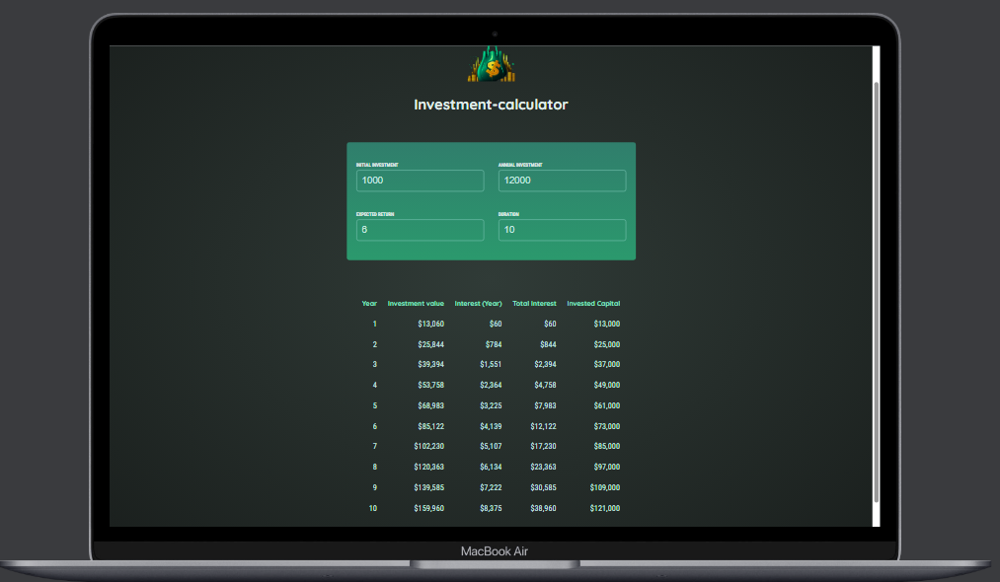

```markdown
# Investment Calculator - Create-React-App



This is a simple React application that allows users to calculate their investments over multiple years, including interest at the end of every year, and provides a summary of their returns. It's a helpful tool for individuals looking to plan and track their investments.

## Features

- Calculate the investment amount for each year.
- Calculate the interest earned at the end of each year.
- View a summary of total returns at the end of the investment period.
- Easy-to-use interface with a clean design.

## How to Use

1. Clone this repository to your local machine.

   ```bash
   git clone https://github.com/ajewoleOlugbenga/investment-calculator.git
   ```

2. Navigate to the project directory.

   ```bash
   cd investment-calculator
   ```

3. Install the required dependencies.

   ```bash
   npm install
   ```

4. Start the development server.

   ```bash
   npm start
   ```

5. Open your web browser and access the app at `http://localhost:3000`.

6. Enter your initial investment amount, annual interest rate, and the number of years you want to calculate.

7. Click the "Calculate" button to see the investment breakdown for each year and the total returns at the end of the investment period.

8. You can reset the form and calculate new investments as needed.

## Technologies Used

- React
- Javascript
- Css
- Html

## Screenshots


## Author

- [Olugbenga Ajewole](https://github.com/ajewoleOlugbenga)

Feel free to reach out with any questions or feedback! ₦

